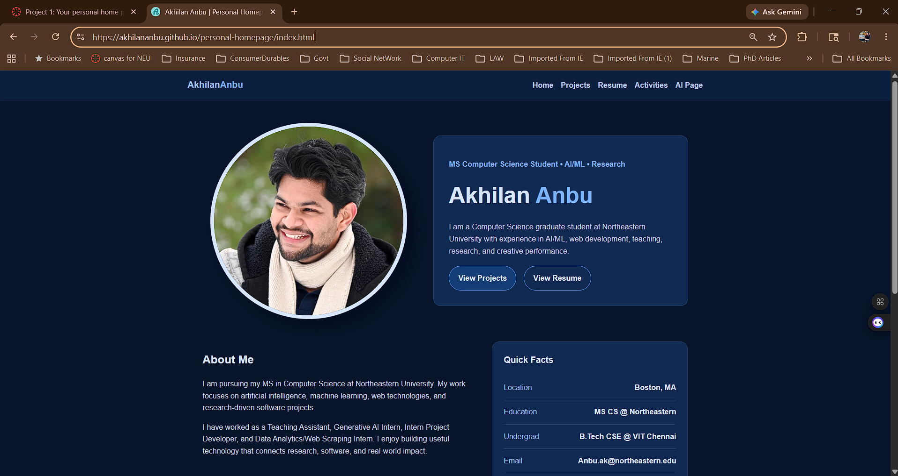

# Personal Homepage

## Author

Akhilan Anbu

## Class Link

https://northeastern.instructure.com/courses/249954

## Live Website

https://akhilananbu.github.io/personal-homepage/index.html

## Video Demo

YouTube demo link: https://youtu.be/qkWYiHKzMIs

## Screenshot of the Website



## Project Objective

The objective of this project is to build a personal homepage using vanilla HTML5, CSS3, and ES6 JavaScript modules. The website introduces my background, education, technical skills, projects, resume, extracurricular activities, music interests, and creative AI-generated page through a clean, responsive, and accessible front-end design.

## Project Description

This website is a personal homepage for Akhilan Anbu, a Computer Science graduate student interested in AI/ML, web development, research, teaching, and music.

The site is designed to help visitors quickly understand who I am, what I work on, my technical background, my resume, my major projects, and my extracurricular interests. The regular pages use a dark navy-blue theme for a clean and professional look, while the AI-generated page uses a colorful light theme to intentionally stand out as the creative AI section.

This is a front-end only static website built without a backend, without jQuery, and without component libraries.

## Pages Included

This project includes multiple HTML pages with different URLs:

- `index.html` - Main personal homepage
- `projects.html` - Projects page with an interactive JavaScript filter
- `resume.html` - Resume page
- `activities.html` - Extracurricular activities, leadership, music, and MIT performance page
- `ai-page.html` - AI-generated creative page

## Design Document

The design document is included in the `docs/` folder.

It includes:

- Project description
- User personas
- User stories
- Design mockups

File:

- `docs/design-document.md`

## Creative Addition

The projects page includes an original JavaScript-based project filter.

Users can click category buttons such as:

- All
- AI/ML
- Research
- Web Dev
- Music

When a button is clicked, the project cards update dynamically based on the selected category. This feature was written using ES6 JavaScript modules without using jQuery or external component libraries.

## Original JavaScript Functionality

The original JavaScript functionality is implemented in:

- `js/creative.js`

It contains more than five lines of custom JavaScript code and uses event listeners, dataset attributes, and class changes to filter project cards dynamically.

The website also uses ES6 modules through script tags such as:

```html
<script type="module" src="./js/main.js"></script>
```

and the `package.json` file includes:

```json
"type": "module"
```

## Technologies Used

- HTML5
- CSS3
- JavaScript ES6 modules
- CSS Grid
- Flexbox
- Prettier
- ESLint
- GitHub Pages
- W3C Markup Validator

## File Organization

The project files are organized into separate folders:

- `css/` contains the stylesheet
- `js/` contains JavaScript module files
- `images/` contains image files, favicon, and README screenshot
- `docs/` contains the design document

Main files:

- `index.html`
- `projects.html`
- `resume.html`
- `activities.html`
- `ai-page.html`
- `package.json`
- `README.md`
- `LICENSE`

## Instructions to Build and Run

1. Clone or download this repository.

2. Open the project folder in VS Code.

3. Install dependencies:

```bash
npm install
```

4. Format the project using Prettier:

```bash
npm run format
```

5. Run ESLint:

```bash
npm run lint
```

6. Open `index.html` in a browser, or use the VS Code Live Server extension.

## Validation

The HTML files were checked using the W3C Markup Validation Service.

Validated files:

- `index.html`
- `projects.html`
- `resume.html`
- `activities.html`
- `ai-page.html`

All pages showed no errors or warnings after validation.

## Accessibility

All visible images include meaningful `alt` text.

Examples include:

- Profile photo
- Singing/music image
- MIT performance image
- Homepage screenshot in the README

The website also uses standard semantic HTML elements such as:

- `header`
- `nav`
- `main`
- `section`
- `article`
- `footer`
- `button`

Buttons are implemented using real `<button>` elements, not non-standard `div` or `span` elements.

## Styling and Layout

The regular pages use a dark navy-blue theme to keep the website clean, professional, and consistent.

The AI-generated page uses a separate colorful light theme with gradients, layered cards, colorful borders, and a terminal-style section to make it visually different from the rest of the site.

The website uses CSS Grid and Flexbox for layout and responsiveness.

The CSS is organized clearly and does not use `!important`.

## Deployment

The website is deployed publicly using GitHub Pages.

Live website:

https://akhilananbu.github.io/personal-homepage/index.html

## Package File

The project includes a `package.json` file listing the project metadata, module type, scripts, and development dependencies.

It includes scripts for:

```bash
npm run format
```

and

```bash
npm run lint
```

## License

This project uses the MIT License.

The license file is included as:

- `LICENSE`

## GenAI Usage

Most of the website structure, styling, project content, JavaScript functionality, README, and design document were written and customized by me.

I used ChatGPT, GPT-5.5 Thinking, only to help generate and refine content for the AI-generated creative page section and to help organize some wording for the README and design explanation.

Model used:

- ChatGPT, GPT-5.5 Thinking

Example prompts used:

- "Generate a creative AI-style page for my personal homepage."
- "Create a future digital workspace page for a CS student interested in AI, web development, research, and music."
- "Make the AI-generated page simple, clean, and suitable for a personal homepage project."
- "Help me write a concise README section describing GenAI usage."

The AI-generated content was reviewed, edited, and customized by me before being added to the final project.

## Code Review

The project includes the required files and is prepared for code review as part of the course submission.

## Notes

This project was built as a static personal homepage using only front-end technologies. It includes meaningful personal information, multiple pages, organized files, original JavaScript functionality, accessibility features, deployment, video demonstration, GenAI documentation, and MIT licensing.
